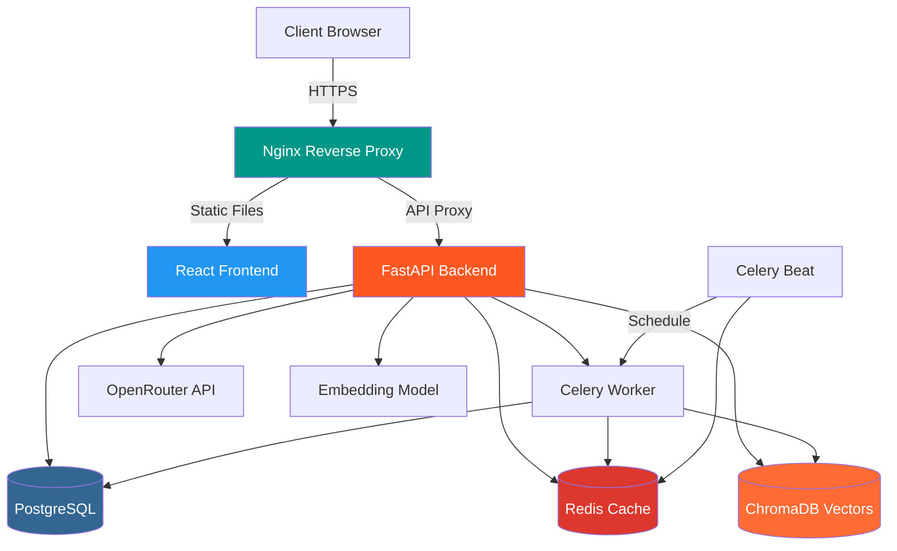
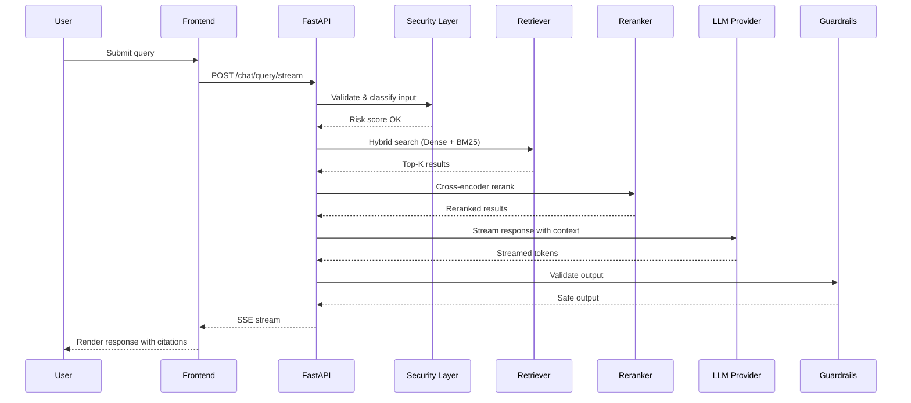
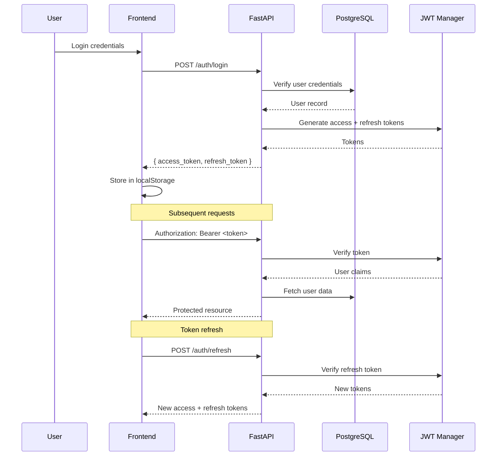
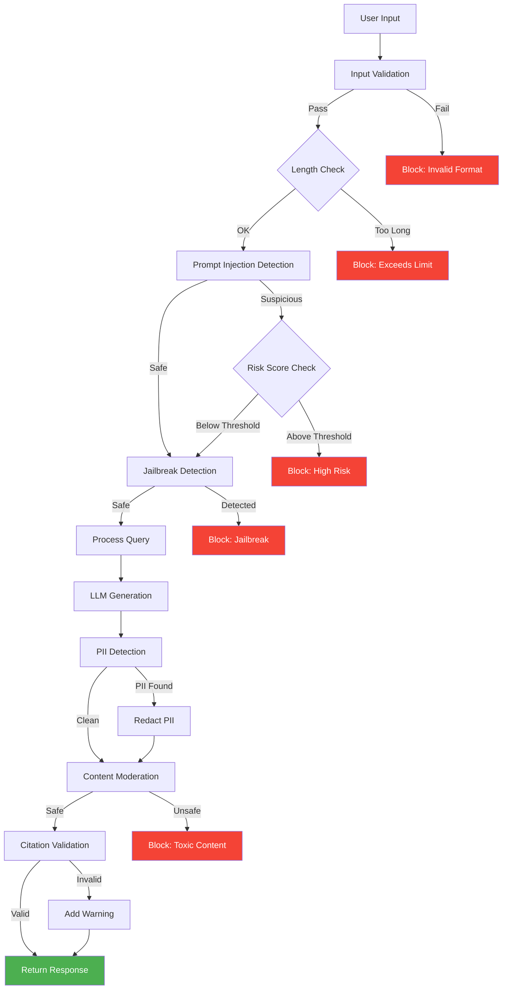
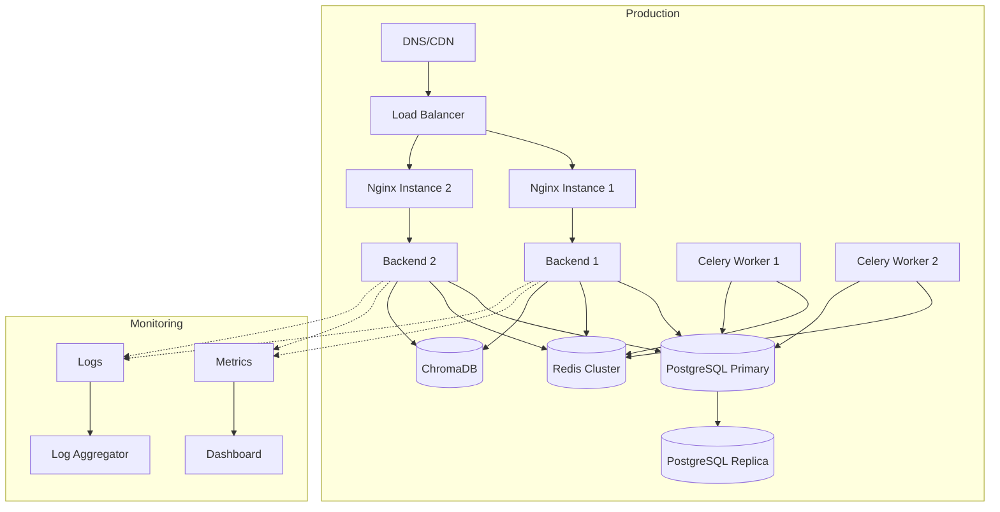

# Architecture Diagrams

## Overall System Architecture

```mermaid
graph TB
    Client[Client Browser] -->|HTTPS| Nginx[Nginx Reverse Proxy]
    Nginx -->|Static Files| Frontend[React Frontend]
    Nginx -->|API Proxy| Backend[FastAPI Backend]
    
    Backend --> PostgreSQL[(PostgreSQL)]
    Backend --> Redis[(Redis Cache)]
    Backend --> ChromaDB[(ChromaDB Vectors)]
    
    Backend --> CeleryWorker[Celery Worker]
    CeleryWorker --> PostgreSQL
    CeleryWorker --> ChromaDB
    CeleryWorker --> Redis
    
    CeleryBeat[Celery Beat] --> Redis
    CeleryBeat -->|Schedule| CeleryWorker
    
    Backend --> OpenRouter[OpenRouter API]
    Backend --> Embeddings[Embedding Model]
    
    style Nginx fill:#009688,color:#fff
    style Backend fill:#FF5722,color:#fff
    style Frontend fill:#2196F3,color:#fff
    style PostgreSQL fill:#336791,color:#fff
    style Redis fill:#DC382D,color:#fff
    style ChromaDB fill:#FF6B35,color:#fff
```

## RAG Request Flow

```mermaid
sequenceDiagram
    participant U as User
    participant FE as Frontend
    participant API as FastAPI
    participant SEC as Security Layer
    participant RET as Retriever
    participant RR as Reranker
    participant LLM as LLM Provider
    participant GR as Guardrails

    U->>FE: Submit query
    FE->>API: POST /chat/query/stream
    API->>SEC: Validate & classify input
    SEC-->>API: Risk score OK
    API->>RET: Hybrid search (Dense + BM25)
    RET-->>API: Top-K results
    API->>RR: Cross-encoder rerank
    RR-->>API: Reranked results
    API->>LLM: Stream response with context
    LLM-->>API: Streamed tokens
    API->>GR: Validate output
    GR-->>API: Safe output
    API-->>FE: SSE stream
    FE-->>U: Render response with citations
```

## Authentication Flow

```mermaid
sequenceDiagram
    participant U as User
    participant FE as Frontend
    participant API as FastAPI
    participant DB as PostgreSQL
    participant JWT as JWT Manager

    U->>FE: Login credentials
    FE->>API: POST /auth/login
    API->>DB: Verify user credentials
    DB-->>API: User record
    API->>JWT: Generate access + refresh tokens
    JWT-->>API: Tokens
    API-->>FE: { access_token, refresh_token }
    FE->>FE: Store in localStorage
    
    Note over FE,API: Subsequent requests
    FE->>API: Authorization: Bearer <token>
    API->>JWT: Verify token
    JWT-->>API: User claims
    API->>DB: Fetch user data
    API-->>FE: Protected resource
    
    Note over FE,API: Token refresh
    FE->>API: POST /auth/refresh
    API->>JWT: Verify refresh token
    JWT-->>API: New tokens
    API-->>FE: New access + refresh tokens
```

## Security Pipeline

```mermaid
graph TD
    Input[User Input] --> Validate[Input Validation]
    Validate --> |Pass| Length{Length Check}
    Validate --> |Fail| Block1[Block: Invalid Format]
    Length --> |OK| Inject[Prompt Injection Detection]
    Length --> |Too Long| Block2[Block: Exceeds Limit]
    Inject --> |Safe| Jailbreak[Jailbreak Detection]
    Inject --> |Suspicious| Risk{Risk Score Check}
    Risk --> |Below Threshold| Jailbreak
    Risk --> |Above Threshold| Block3[Block: High Risk]
    Jailbreak --> |Safe| Process[Process Query]
    Jailbreak --> |Detected| Block4[Block: Jailbreak]
    
    Process --> LLM[LLM Generation]
    LLM --> PII[PII Detection]
    PII --> |Clean| Moderate[Content Moderation]
    PII --> |PII Found| Redact[Redact PII]
    Redact --> Moderate
    Moderate --> |Safe| Cite[Citation Validation]
    Moderate --> |Unsafe| Block5[Block: Toxic Content]
    Cite --> |Valid| Output[Return Response]
    Cite --> |Invalid| Warn[Add Warning]
    Warn --> Output

    style Block1 fill:#f44336,color:#fff
    style Block2 fill:#f44336,color:#fff
    style Block3 fill:#f44336,color:#fff
    style Block4 fill:#f44336,color:#fff
    style Block5 fill:#f44336,color:#fff
    style Output fill:#4CAF50,color:#fff
```

## Deployment Architecture

```mermaid
graph TB
    subgraph Production
        DNS[DNS/CDN] --> LB[Load Balancer]
        LB --> Nginx1[Nginx Instance 1]
        LB --> Nginx2[Nginx Instance 2]
        
        Nginx1 --> API1[Backend 1]
        Nginx2 --> API2[Backend 2]
        
        API1 --> PG[(PostgreSQL Primary)]
        API2 --> PG
        PG --> PGR[(PostgreSQL Replica)]
        
        API1 --> Redis[(Redis Cluster)]
        API2 --> Redis
        
        API1 --> Chroma[(ChromaDB)]
        API2 --> Chroma
        
        Worker1[Celery Worker 1] --> Redis
        Worker2[Celery Worker 2] --> Redis
        Worker1 --> PG
        Worker2 --> PG
    end

    subgraph Monitoring
        Metrics[Metrics] --> Dashboard[Dashboard]
        Logs[Logs] --> LogAgg[Log Aggregator]
    end

    API1 -.-> Metrics
    API2 -.-> Metrics
    API1 -.-> Logs
    API2 -.-> Logs
```
